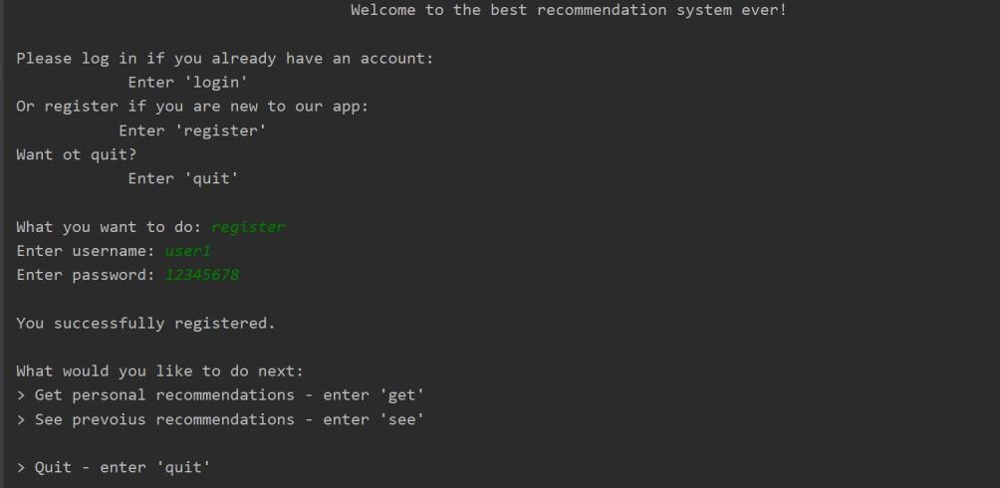
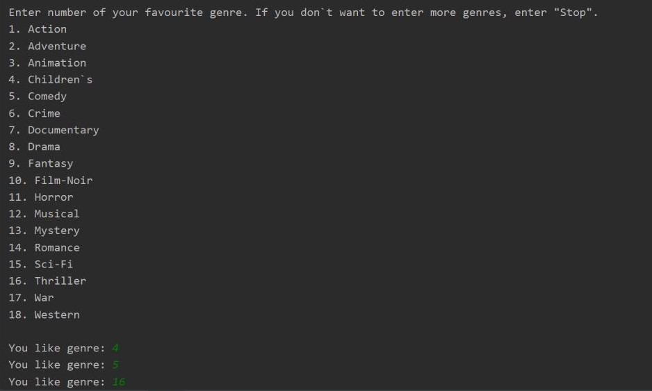
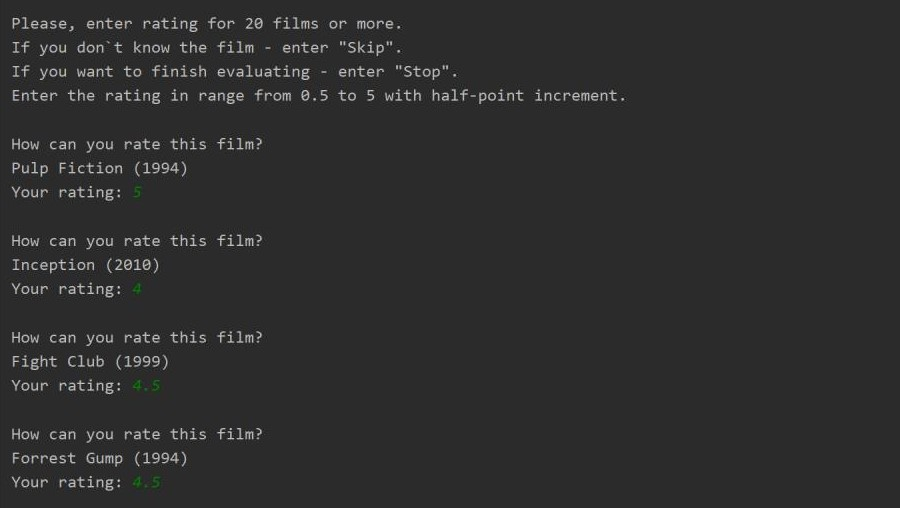
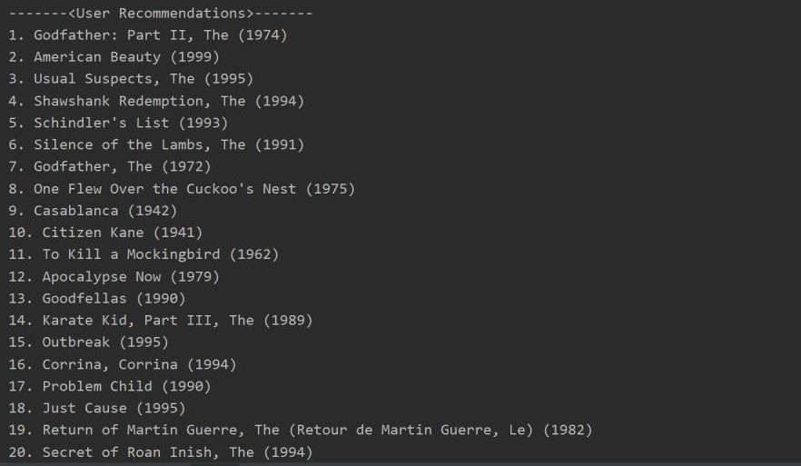

# WatchIt
## Description
"WatchIt" is a recommender system, which helps you to choose movies, that fit best to your prefernces. Start with choosing your
favourite categories of films. Then evaluate movies, that you have already seen. Taking to account your ratings, system picks up and 
proposes 20 films, that match your tastes best. 

Now you can use WatchIt onn this web-site! http://lero4ka.pythonanywhere.com/
## Instalation (copying the project)
Install our project by using: 
```python
$ git clone https://github.com/Film-scientists/Watchit
```

Follow the next path to unzip file you need. Watchit --> wach_it --> files --> data --> ratings_1M.zip - unzip ratings_1M.csv file to current directory (data). 

Run script.py from wach_it folder. 

## Installation (distribution kit)
Install our project by downloading ``` Watch_It-1.0.0.tar.gz ```

Create new projects and move ``` Watch_It-1.0.0.tar.gz ``` there.

Then use:
```
cd dist
tar xzvf Watch_It-1.0.0.tar.gz
cd Watch_It-1.0.0
python setup.py install
```
Run script.py from wach_it folder

## Usage example
First of all you need to register in our system. Then, you have 2 options:'get' - to get recommendations and 'see' - to see previous recommendations. 
Let's get some recommendations! At first you have to choose at least 3 your favourite genres. 
Now we propose you to rate best films of these genres. Rate at least 20 films. 
After you rate 20 films, you get recommendations! 
## Data 
Our recommendation system is based on the dataset of users and their ratings from movielens.org. Program's input are 3 user's favourite genres and 20 ratings of films. The output is list of 20 recommended films. Recomendations are saved to the file, so user will be able to find them next time he runs the program. 
## Description of modules and functions
script.py is module which runs whole program. Other modules are contained in package 'files'.

auth.py contains class Authenticator, User and AuthException. They handle with user's registration and loginning. Start.py handles interaction with user on the beginning of the program. Function ask_ratings() asks for user's favourite genres and function ask_ratings() asks ratings for films. main() function of start.py unites all other functions and returns dataframe with user's ratings. 

neighbour.py is a module, where recommendation algorithm based on finding nearest neighbours is implemented. 

matrix.py is a module, where recommendation algorithm based on matrix factorization is implemented. 


recommendation_engine.py is a module which unites our two recommendations algorithms - searching for nearest neighbours and matrix factorization. Function load() gets all needed data, function quintessential() combines results of two recommendation algorithms in certain proportion and return recommendations. Function core() unites all these processes and prints recommendations. 

film_system.py containes class FilmSystem, which ties all modules together. Methods login(self) and register(self) use classes from auth.py to register and log in user. Method get(self) uses function core() from recommendation_engine.py to get recommendations, print and save them to the file. Method main(self) organizes interaction with user.

## Tests
test_modules.py executes testing of all modules by calling modules with unittests from tests folder. You can run test_modules.py to get sure that everything works properly.

## Video presentation
[video presentation is here](https://www.youtube.com/watch?v=sYFv4N2ajDg&feature=youtu.be)
